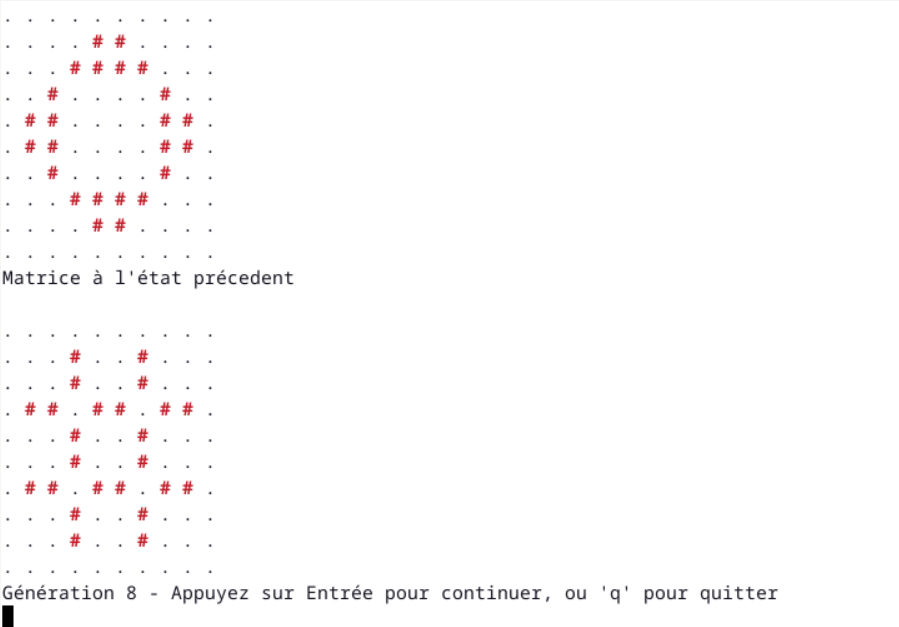

# Jeu de la Vie

Ce projet implémente le Jeu de la Vie de John Conway dans un terminal Linux. Il permet de visualiser et d’expérimenter avec différents univers et règles, ainsi que de charger des configurations de graines (“seeds”) prédéfinies ou aléatoires.

## Fonctionnalités principales

**Visualisation** : Affiche l'univers dans le terminal avec des cellules vivantes en rouge (#) et des cellules mortes (.).

**Univers fini ou périodique** : Choisissez entre un univers à bords fixes ou un univers à bords périodiques.

**Règles personnalisées** : Paramétrez vos propres règles de naissance et de survie, ou utilisez des règles classiques (“B3/S23”).

**Chargement de graines** : Chargez des configurations prédéfinies ou générez des univers aléatoires.

**Mode animation** : Observez l'évolution automatique ou contrôlez-la de manière interactive.

## Ressources utiles
- [Règles du Jeu de la Vie](https://en.wikipedia.org/wiki/Conway%27s_Game_of_Life)
- [Configurations classiques](https://conwaylife.com/wiki/Main_Page)

